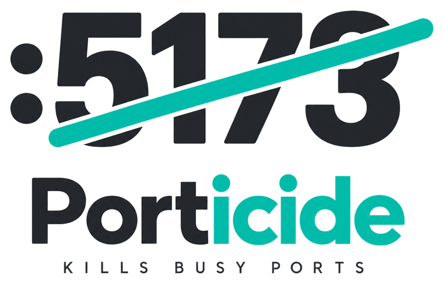
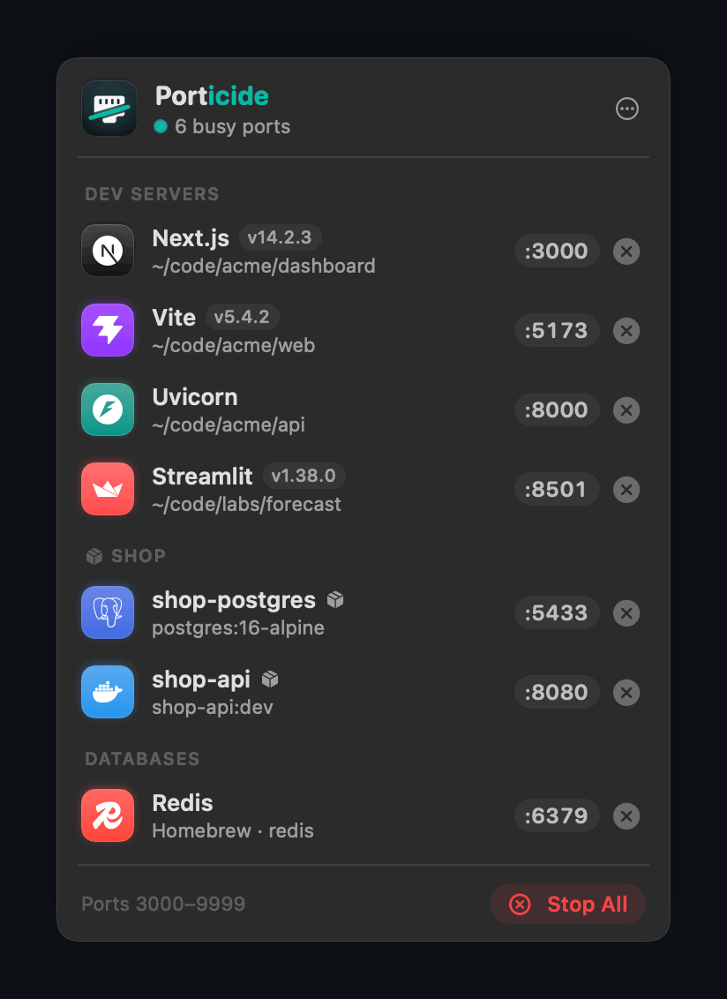
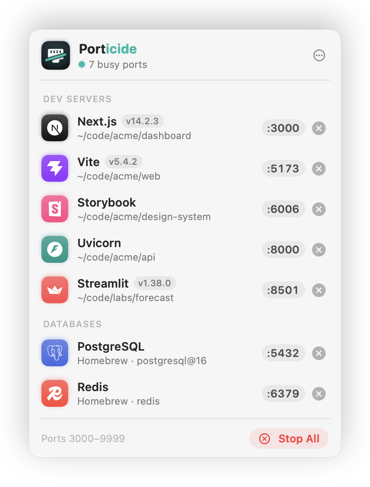
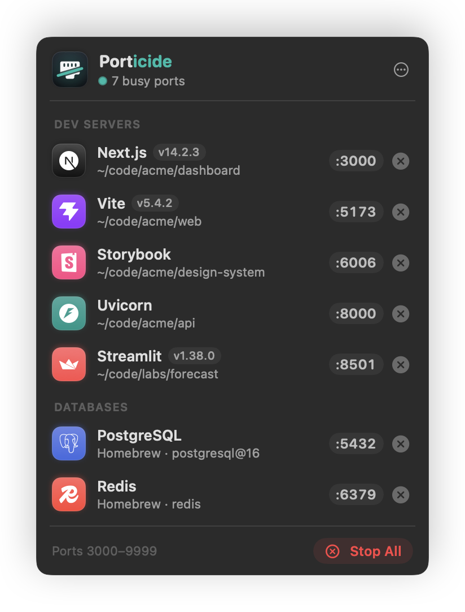
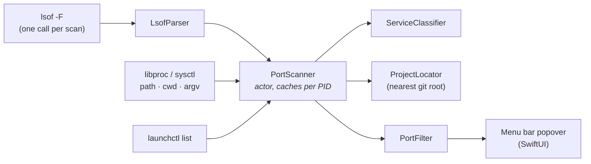

<p align="center">
  <picture>
    <source media="(prefers-color-scheme: dark)" srcset="docs/assets/logo-dark.png">
    
  </picture>
</p>

<p align="center">
  <b>See what's holding your ports. Stop it in one click.</b><br>
  A tiny macOS menu bar app for developers who run one dev server too many.
</p>

<p align="center">
  <a href="https://github.com/zontaggio/porticide/actions/workflows/ci.yml"></a>
  <a href="https://github.com/zontaggio/porticide/releases/latest"></a>
  
  
  <a href="LICENSE"></a>
</p>

<p align="center">
  
</p>

## Why

```
Error: listen EADDRINUSE: address already in use :::3000
```

Vite on 5173, Next.js on 3000, a FastAPI backend on 8000, a Streamlit prototype from last week still holding 8501. Finding and stopping them usually means `lsof -i :3000`, copying a PID and `kill`, over and over.

Porticide lives in the menu bar, shows every dev server that's listening, tells you **what it is and which project it belongs to**, and stops it with one click.

## Features

- **Knows your stack.** Recognises 38 dev servers, databases and tools (Vite, Next.js, Django, FastAPI, Rails, PostgreSQL, Redis, Docker, Ollama and more) and shows each one's logo, version and project folder.
- **One click to stop, and it stays stopped.** Sends `SIGTERM` (<kbd>⌥</kbd>-click for `SIGKILL`). Services kept alive by launchd, like `brew services` or background gateways, are stopped through `launchctl` so they don't come back 10 seconds later. If something else restarts a server (nodemon, pm2…), Porticide names it and offers to stop it too.
- **Never in your way.** No dialogs: confirmations (off by default) and errors appear inline, so the popover stays open. If a process belongs to another user, you get the exact `sudo kill` command to copy.
- **Only what matters.** macOS services (AirPlay Receiver on 5000/7000, Control Center…), app helpers and shared Bonjour sockets are hidden by default. Servers are grouped into *Dev Servers*, *Databases* and *Services*.
- **Handy shortcuts.** Open `localhost:<port>` in the browser, reveal the project in Finder, open it in Terminal, copy the URL or PID.
- **Quietly native.** SwiftUI and AppKit, no dependencies. Shows the busy-port count in the menu bar, can open at login and can notify you when a process stops.
- **Light on resources.** One `lsof` call per scan; everything else is read straight from the kernel with `libproc` and `sysctl`, and cached per process.

<p align="center">
  
  
</p>

## Install

### Download

1. Download `Porticide-<version>.zip` from the [latest release](https://github.com/zontaggio/porticide/releases/latest) (universal: Apple silicon and Intel).
2. Unzip it and move **Porticide.app** to `/Applications`.
3. The app is ad-hoc signed, not notarized, so the first time **right-click it → Open**, or run:

   ```bash
   xattr -dr com.apple.quarantine /Applications/Porticide.app
   ```

### Build from source

Requires macOS 13+ and Xcode 16+ (Swift 6).

```bash
git clone https://github.com/zontaggio/porticide.git
cd porticide
make install    # builds Porticide.app and copies it to /Applications
```

## Usage

| Action | How |
| --- | --- |
| Show busy ports | Click the icon in the menu bar |
| Stop a server | Click <kbd>⊗</kbd> next to its port (with *Ask before stopping* on, click the red **Stop** that appears) |
| Force quit (`SIGKILL`) | <kbd>⌥</kbd>-click <kbd>⊗</kbd>, or right-click → **Force Quit** |
| Open in the browser | Hover a row and click the Safari icon |
| More actions | Right-click a row |
| Refresh / Settings / Quit | <kbd>⌘R</kbd> / <kbd>⌘,</kbd> / <kbd>⌘Q</kbd> while the popover is open |

Settings let you change the scanned port range (3000–9999 by default), the refresh interval, whether to ask before stopping, sounds, notifications and whether system processes are shown.

## How it works



1. **Discover.** `lsof -nP -iTCP -sTCP:LISTEN -iUDP -F cLPn` lists listening sockets in lsof's field format, which, unlike the table, never truncates process names.
2. **Inspect.** For each new PID, the executable path (`proc_pidpath`), working directory (`proc_pidinfo`) and arguments (`sysctl(KERN_PROCARGS2)`) come straight from the kernel, with no `ps` or extra `lsof` per process. The project is the nearest git root above the working directory, worktrees included.
3. **Classify.** Rules match the *file names* of the executable and its arguments (`node …/.bin/vite` → Vite), so `bundle exec` is never mistaken for Bun. Unknown processes get a hint from well-known ports (`5173` → *usually Vite*).
4. **Filter.** Other users' processes, macOS system paths, app helpers and multicast DNS sockets are hidden; Homebrew services such as PostgreSQL stay visible.
5. **Stop.** Plain processes get a signal. Processes that `launchctl list` attributes to a LaunchAgent are booted out of launchd instead, since `KeepAlive` would restart them.

### Project structure

```
Sources/
├── PorticideKit/           # Pure Swift, no UI: fully unit-tested
│   ├── Models/             # ListeningSocket, PortEntry, ServiceKind, PortRange
│   ├── Scanning/           # lsof parser, PortScanner actor, libproc inspector
│   ├── Classification/     # ServiceClassifier, WellKnownPorts
│   ├── Filtering/          # PortFilter
│   └── ProcessKiller.swift
└── Porticide/              # The menu bar app (AppKit + SwiftUI)
    ├── App/                # Entry point, AppDelegate, screenshot renderer
    ├── Design/             # Brand colours, logo mark, service icons
    ├── MenuBar/            # Popover, rows, stop animation, view model
    ├── Settings/           # Preferences, settings window, login item
    ├── Services/           # PortMonitor, notifications
    └── Resources/Logos/    # Service logos (Simple Icons)
Tests/PorticideKitTests/    # Swift Testing, including a real-lsof integration test
```

## Development

```bash
make build        # debug build
make test         # run the test suite
make run          # run from the terminal (login item and notifications need the .app)
make app          # build/Porticide.app
make screenshots  # regenerate the README images from demo data
make icon         # regenerate the app icon
make logos        # re-download service logos from Simple Icons
```

You can also open `Package.swift` in Xcode. See [CONTRIBUTING.md](CONTRIBUTING.md) for how to teach Porticide about a new dev server.

## Credits

Service logos come from [Simple Icons](https://simpleicons.org) (CC0). All trademarks belong to their respective owners.

## License

[MIT](LICENSE) © Giordano Zonta
